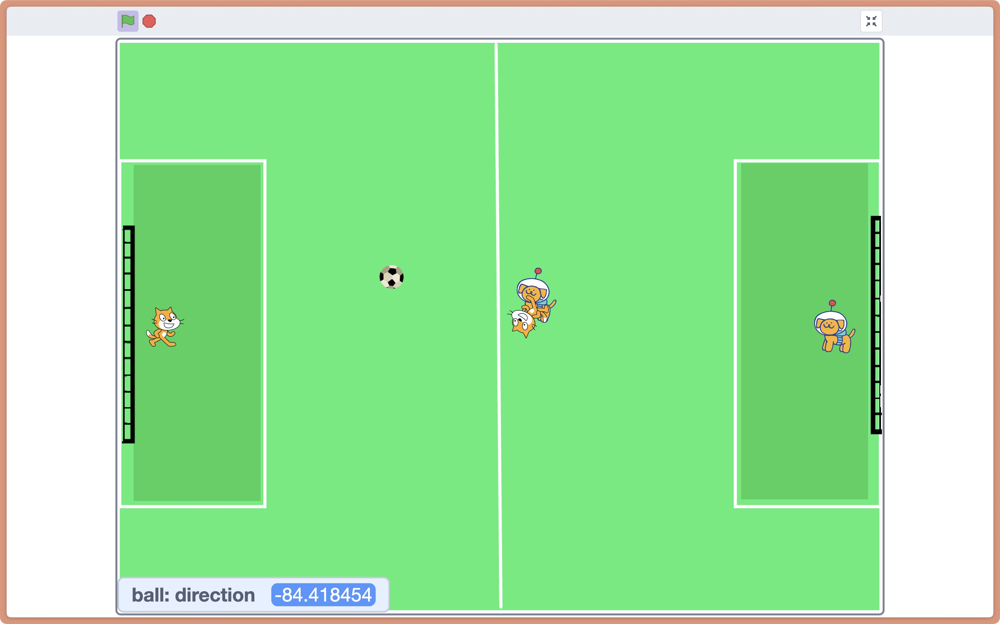
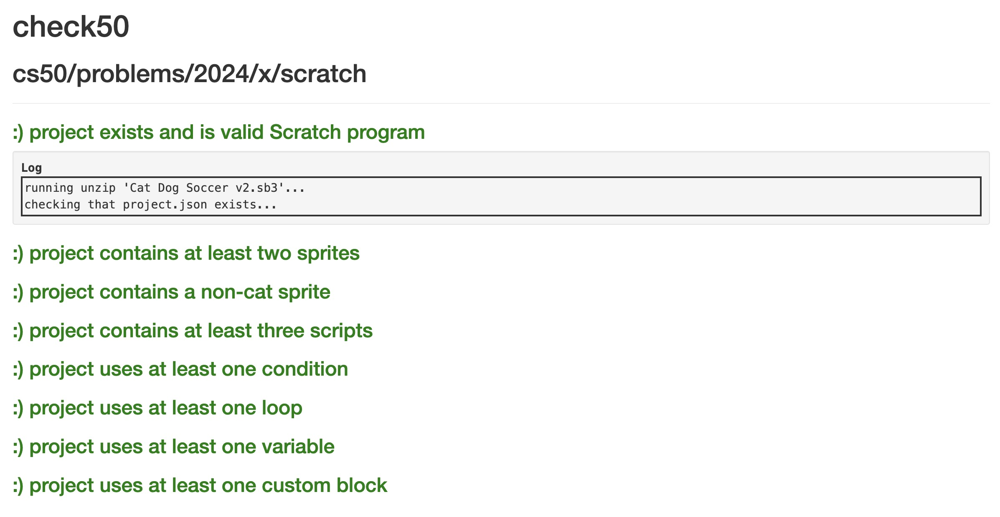

# Week 0 Scratch (2024) problem set 0

Computer Science. Computational Thinking. Problem Solving: Inputs, Outputs. Representation: Unary, Binary, Decimal, ASCII, Unicode, RGB. Abstraction. Algorithms. Running Times. Pseudocode. Scratch: Functions, Arguments, Return Values; Variables; Boolean Expressions, Conditionals; Loops; Events; Threads.

1. lecture [cs50.harvard.edu/x/2024/weeks/0/](https://cs50.harvard.edu/x/2024/weeks/0/)
2. notes [cs50.harvard.edu/x/2024/notes/0/](https://cs50.harvard.edu/x/2024/notes/0/)
3. [problem set 0](https://cs50.harvard.edu/x/2024/psets/0/)

## Starting from Scratch

1. assignment 1 of 1
2. [requirements](https://cs50.harvard.edu/x/2024/psets/0/scratch/)
3. TL;DR Create a project in Scratch that meets specified requirements: at least 2 sprites, 3 scripts, 1 conditional/loop/var, 1 custom block/function, be of a certain complexity, well designed, etc
4. [Cat Dog soccer v2 on Scratch](https://scratch.mit.edu/projects/1111211695)

[Submission](https://submit.cs50.io/check50/7beb6f77d591a3c0f219491ae1234c2b9de9d841)

