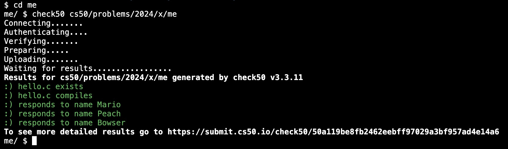
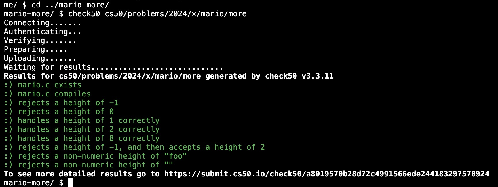
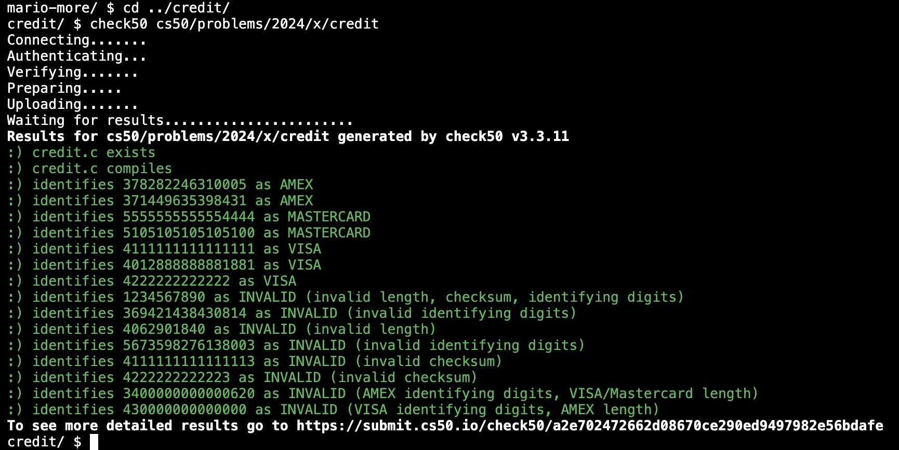

# Week 1 C (2024) problem set 1

C. Source Code. Machine Code. Compiler. Correctness, Design, Style. Visual Studio Code. Syntax Highlighting. Escape Sequences. Header Files. Libraries. Manual Pages. Types. Conditionals. Variables. Loops. Linux. Graphical User Interface (GUI). Command-Line Interface (CLI). Constants. Comments. Pseudocode. Operators. Integer Overflow. Floating-Point Imprecision.

1. lecture [cs50.harvard.edu/x/2024/weeks/1/](https://cs50.harvard.edu/x/2024/weeks/1/)
2. notes [cs50.harvard.edu/x/2024/notes/1/](https://cs50.harvard.edu/x/2024/notes/1/)
3. [problem set 1](https://cs50.harvard.edu/x/2024/psets/1/)

## Hello, It’s Me

1. assignment 1 of 3
2. [requirements](https://cs50.harvard.edu/x/2024/psets/1/me/)
3. TL;DR print out name input
4. [hello.c](./hello.c)

Satisfies requirements

## Mario

1. assignment 2 of 3
2. [requirements](https://cs50.harvard.edu/x/2024/psets/1/mario/more/#mario)
3. TL;DR make # pyramids given the height
4. [mario.c](./mario.c)

Satisfies requirements

## Credit

1. assignment 3 of 3
2. [requirements](https://cs50.harvard.edu/x/2024/psets/1/credit/)
3. TL;DR given a credit card number, determine if the number is a valid Amex, Visa or Mastercard number
4. [credit.c](./credit.c)

Satisfies requirements

