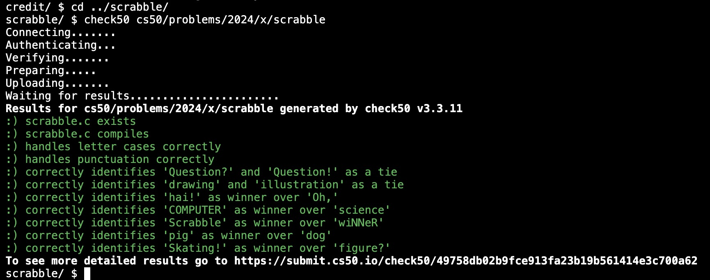
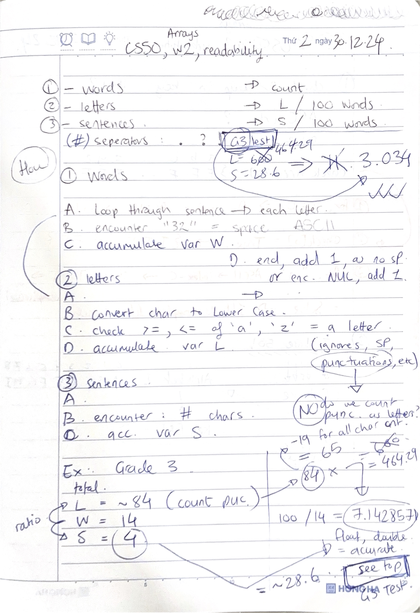
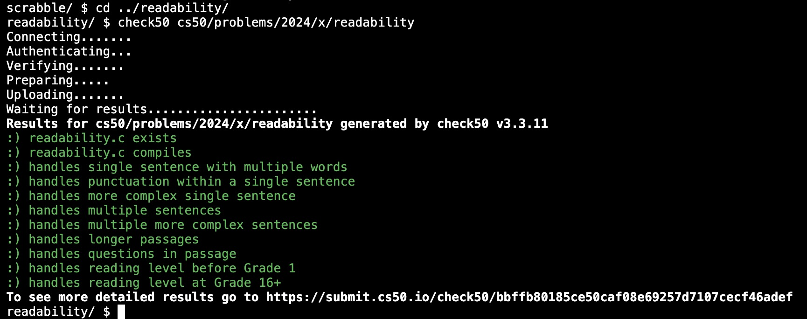
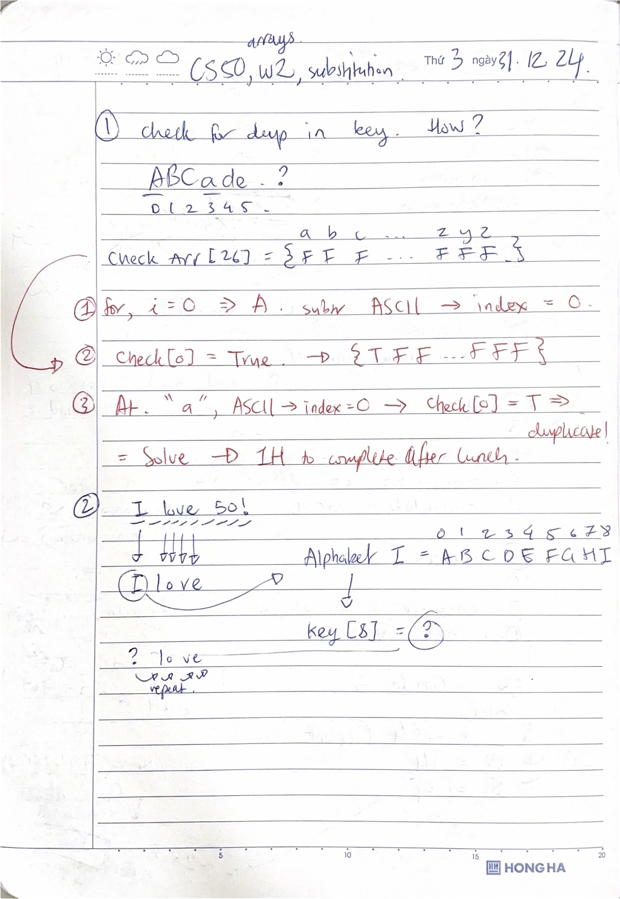
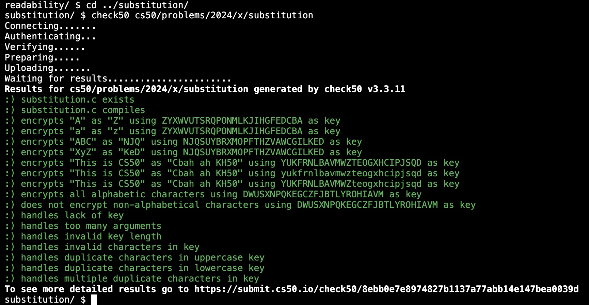

# Week 2 Arrays (2024) problem set 2

Preprocessing. Compiling. Assembling. Linking. Debugging. Arrays. Strings. Command-Line Arguments. Cryptography.

1. lecture [cs50.harvard.edu/x/2024/weeks/2/](https://cs50.harvard.edu/x/2024/weeks/2/)
2. notes [cs50.harvard.edu/x/2024/notes/2/](https://cs50.harvard.edu/x/2024/notes/2/)
3. [problem set 2](https://cs50.harvard.edu/x/2024/psets/2/)

## Scrabble

1. assignment 1 of 3
2. [requirements](https://cs50.harvard.edu/x/2024/psets/2/scrabble/#scrabble)
3. TL;DR work out the number/value sum of each word > which word wins or tie
4. [scrabble.c](./scrabble.c)

Satisfies requirements

## Readability

1. assignment 2 of 3
2. [requirements](https://cs50.harvard.edu/x/2024/psets/2/readability/)
3. TL;DR grade a given text to appropriate reading level; work out by calculating the number of letters, words, sentences within and by a given equation
4. [readability.c](./readability.c)

Satisfies requirements

## Substitution

1. assignment 3 of 3
2. [requirements](https://cs50.harvard.edu/x/2024/psets/1/credit/)
3. TL;DR encrypt some text (only) given a key
4. [substitution.c](./substitution.c)

Satisfies requirements

