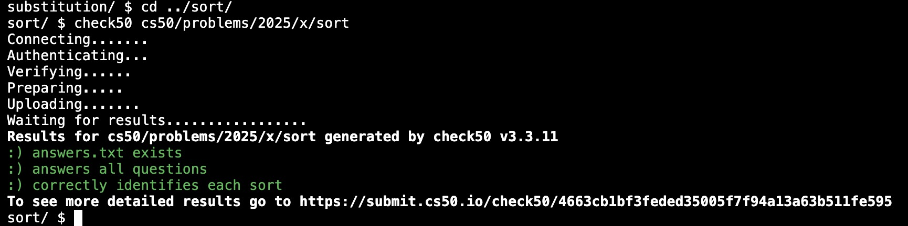
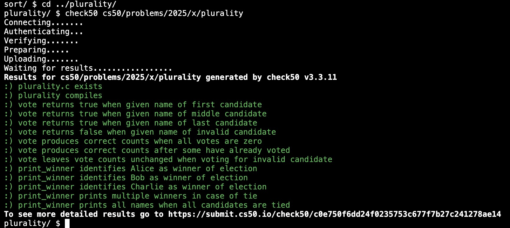
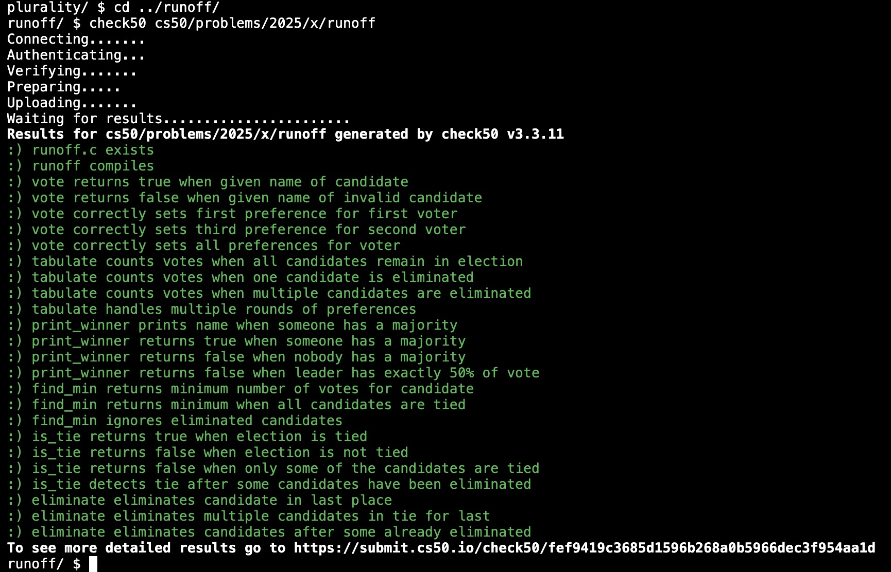

# Week 3 Algorithms (2025) problem set 3

Searching: Linear Search, Binary Search. Sorting: Bubble Sort, Selection Sort, Merge Sort. Asymptotic Notation: Big O, Big Omega, Big Theta. Recursion.

1. [lecture](https://cs50.harvard.edu/x/2025/weeks/3/)
2. [notes](https://cs50.harvard.edu/x/2025/notes/3/)
3. [problem set 3](https://cs50.harvard.edu/x/2025/psets/3/)

## Sort

1. assignment 1 of 3
2. [requirements](https://cs50.harvard.edu/x/2025/psets/3/sort/)
3. [Sort.md](Sort.md)

Satisfies requirements

## Plurality

1. assignment 2 of 3
2. [requirements](https://cs50.harvard.edu/x/2025/psets/3/plurality/)
3. [plurality.c](./plurality.c)

Satisfies requirements

## Runoff

1. assignment 3 of 3
2. [requirements](https://cs50.harvard.edu/x/2025/psets/3/runoff/)
3. [runoff.c](./runoff.c)

Satisfies requirements

