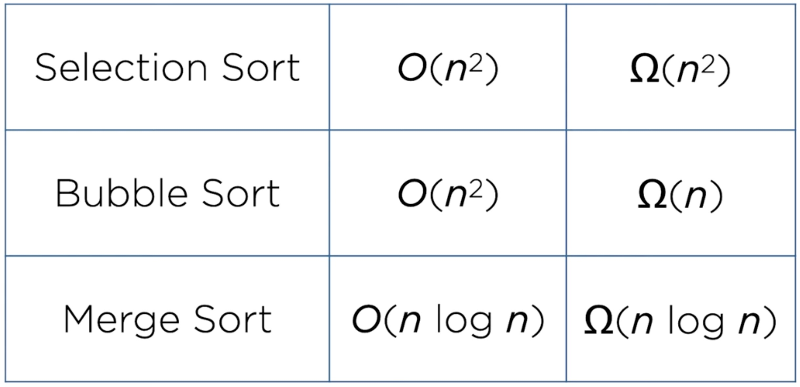

# Problem 1

[Sort](https://cs50.harvard.edu/x/2025/psets/3/sort/)



Data: random, reversed, sorted in 3 sizes: 5k, 10k, 50k

Selection sort

- try 50k random and sorted
- expect: longest time vs 2 other algorithm's results

Bubble sort

- try 50k random and sorted
- expect:
  - random should take long
  - sorted should be fastest due to escape case

Merge sort

- try 50k random and sorted
- expect:
  - fastest random sort
  - relatively fast sorted

|        | 50k random                                                                                | 50k sorted                                                                                | 50k rev                                                                                   | answer                                                 |
| ------ | ----------------------------------------------------------------------------------------- | ----------------------------------------------------------------------------------------- | ----------------------------------------------------------------------------------------- | ------------------------------------------------------ |
| sort 1 | 10.471s<br>8.391s<br>7.899s<br>8.805s<br>~8s<br><br>6.506s<br>5.977s<br>5.989s<br>~6s     | 8.984s<br>2.769s<br>2.577s<br>2.865s<br>~2.7s<br><br>0.775s<br>0.735s<br>0.728s<br>~0.7s  | 10.006s<br>5.891s<br>5.724s<br>5.948s<br>~5.8s<br><br>5.287s<br>6.187s<br>5.275s<br>~5.5s | bubble sort (b)<br><br>- slower<br>- sorted = Omega(n) |
| sort 2 | 10.133s<br>3.183s<br>2.578s<br>3.836s<br>~3.2s<br><br>1.345s<br>0.752s<br>0.766s<br>~1s   | 7.578s<br>2.327s<br>1.012s<br>1.146s<br>~1.5s<br><br>0.765s<br>1.054s<br>1.178s<br>~1s    | 2.501s<br>1.187s<br>1.253s<br>1.297s<br>~1.2s<br><br>1.795s<br>1.663s<br>2.377s<br>~1.9s  | merge sort (a)<br><br>- quickest all                   |
| sort 3 | 12.986s<br>4.733s<br>5.102s<br>6.663s<br>~5.5s<br><br>2.711s<br>2.659s<br>2.686s<br>~2.7s | 12.136s<br>2.971s<br>3.796s<br>3.024s<br>~3.2s<br><br>4.407s<br>3.432s<br>3.224s<br>~3.8s | 4.566s<br>3.071s<br>4.354s<br>3.838s<br>~3.7s<br><br>3.240s<br>4.987s<br>3.098s<br>~3.8s  | selection sort (c)<br><br>- slower<br>- consistent     |

submit answer:

```
sort1 uses: bubble sort

How do you know?: random & reversed relatively slow, but sorted was quickest by far (all 50k)

sort2 uses: merge sort

How do you know?: consistently fastest across all 50k tests, only edged out by bubble sort for sorted

sort3 uses: selection sort

How do you know?: consistently slow across all tests (50k)
```

result:

```
sort/ $ check50 cs50/problems/2025/x/sort
Connecting.......
Authenticating...
Verifying.........
Preparing.....
Uploading.......
Waiting for results.................
Results for cs50/problems/2025/x/sort generated by check50 v3.3.11
:) answers.txt exists
:) answers all questions
:) correctly identifies each sort
To see more detailed results go to https://submit.cs50.io/check50/7bfa52b4a33b3ce19c82485705b8b08e070644e1
```
