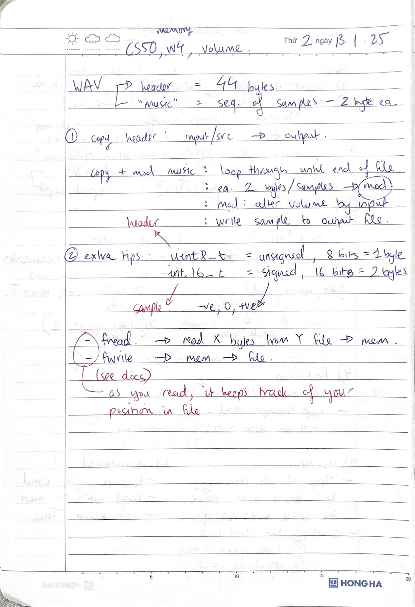
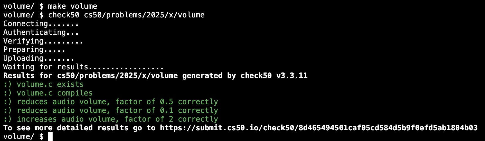
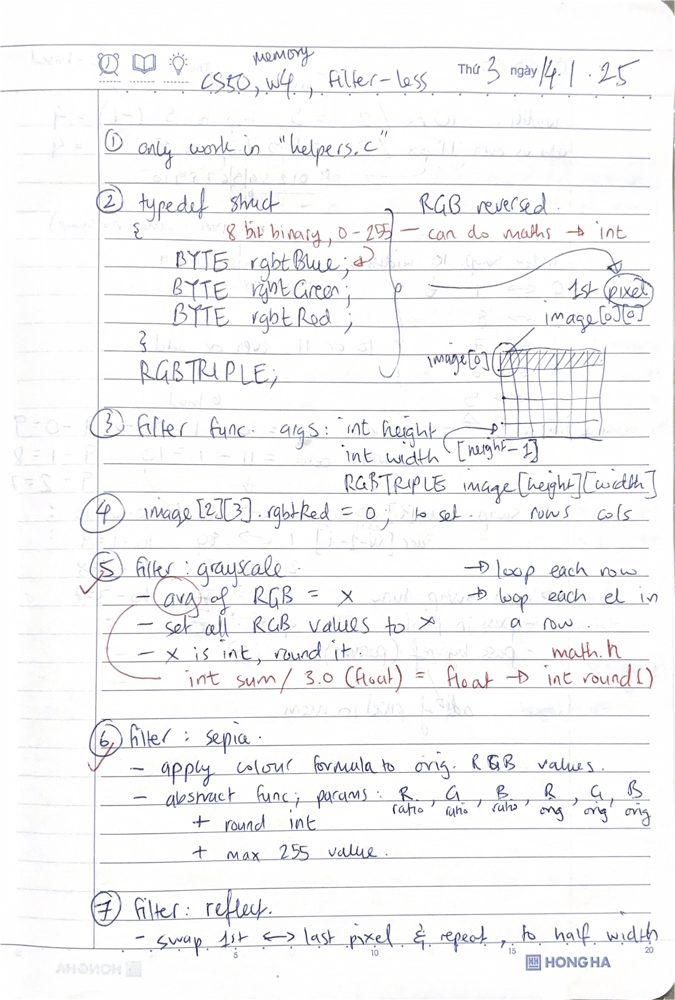
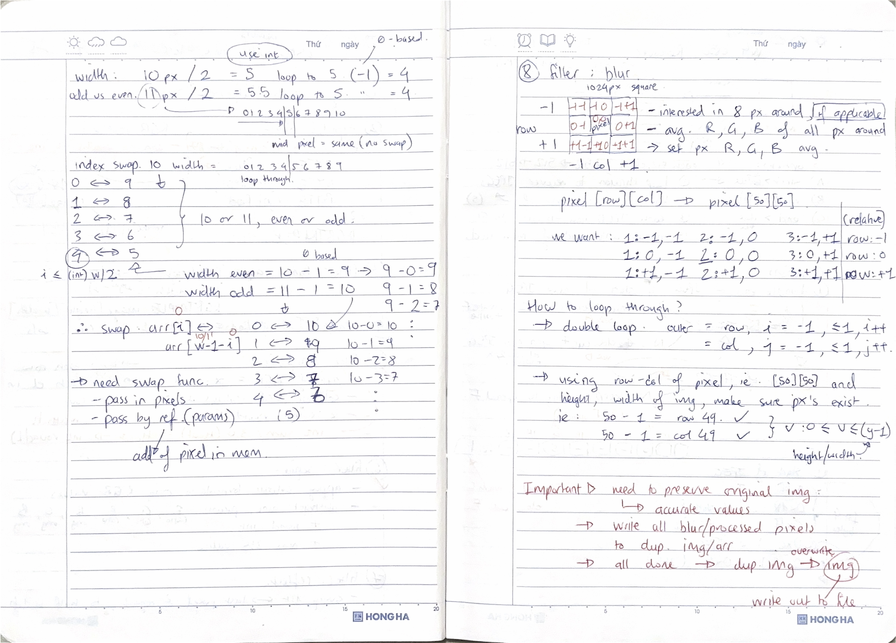
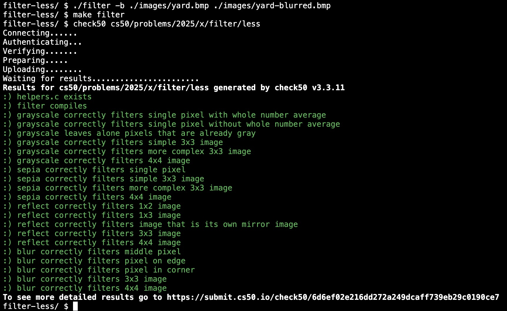
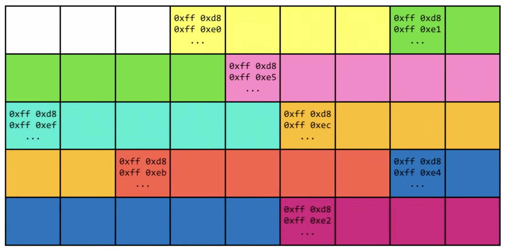
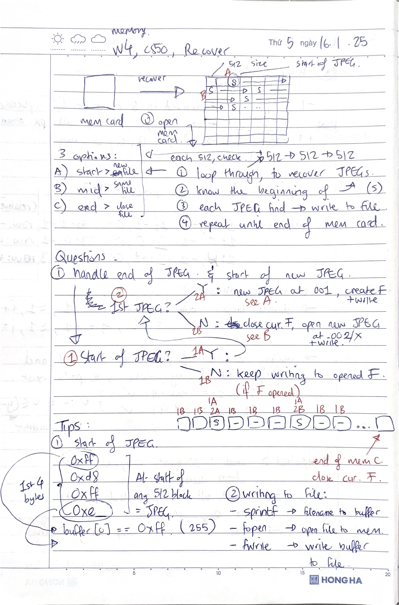
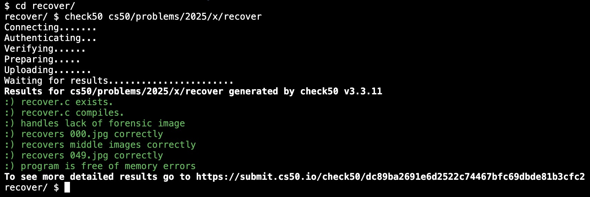

# Week 4 Memory (2025) problem set 4

Searching: Linear Search, Binary Search. Sorting: Bubble Sort, Selection Sort, Merge Sort. Asymptotic Notation: Big O, Big Omega, Big Theta. Recursion.

1. [lecture](https://cs50.harvard.edu/x/2025/weeks/4/)
2. [notes](https://cs50.harvard.edu/x/2025/notes/4/)
3. [problem set 4](https://cs50.harvard.edu/x/2025/psets/4/)

## Volume

1. assignment 1 of 3
2. [requirements](https://cs50.harvard.edu/x/2025/psets/4/volume/)
3. TL;DR given an input .wav file, run a command with a number for the volume factor as additional input, to output a copy .wav file at altered volume level
4. [volume.c](./volume.c)

Satisfies requirements

## Filter (less)

1. assignment 2 of 3
2. [requirements](https://cs50.harvard.edu/x/2025/psets/4/filter/less/)
3. TL;DR given a bitmap (.bmp) input, create filters that can modify and output .bmp files to filter effects/transformations like: grayscale, sepia, reflect and blur
4. [filter-less-helpers.c](./filter-less-helpers.c)

Satisfies requirements

## Recover

1. assignment 3 of 3
2. [requirements](https://cs50.harvard.edu/x/2025/psets/4/recover/)
3. TL;DR given a "memory card" full of photos that has been wiped, write a program to recover the deleted JPEGs
4. [recover.c](./recover.c)

Satisfies requirements

