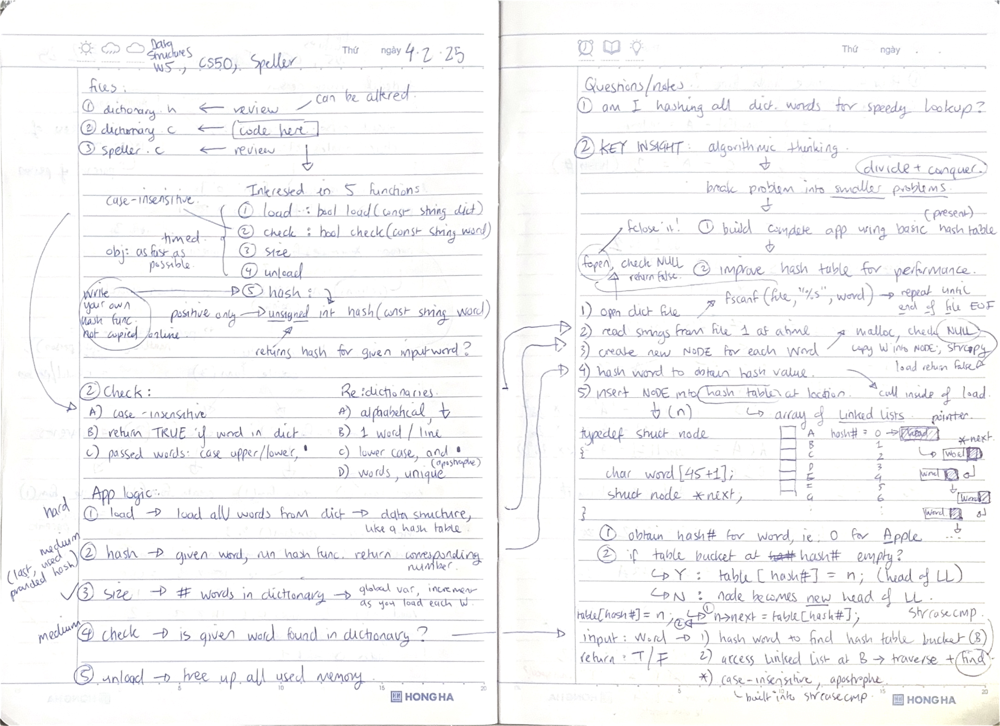

# Week 5 Data structures (2025) problem set 5

Abstract Data Types. Queues, Stacks. Linked Lists. Trees, Binary Search Trees. Hash Tables. Tries.

1. [lecture](https://cs50.harvard.edu/x/2025/weeks/5/)
2. [notes](https://cs50.harvard.edu/x/2025/notes/5/)
3. [problem set 5](https://cs50.harvard.edu/x/2025/psets/5/)

## Inheritance

1. assignment 1 of 2
2. [requirements](https://cs50.harvard.edu/x/2025/psets/5/inheritance/)
3. TL;DR determine a child's blood type (ie: OB, AB, OO, etc) based off the parents and grandparents' blood type. Work with recursive functions, malloc and structs.
4. [inheritance.c](inheritance.c)

Satisfies requirements

## Speller

1. assignment 2 of 2
2. [requirements](https://cs50.harvard.edu/x/2025/psets/5/speller/)
3. TL;DR given a dictionary and a text file, check the text file for spelling errors. The goal is to do this as quickly as possible, using a hash table. The main logic is given in the file `speller.c`, but 5 key functions are left for you to build in `dictionary.c`, they are: `load`, `hash`, `check`, `size` and `unload`. Initially you are also provided a basic hash table/function.
4. [dictionary.c](dictionary.c)
5. I was able to more or less match the staff's implementation with my own hash function (worked it out myself, see page 3 of working notes)

| Staff stats                                                                                                                                                                                    | My stats                                                                                                                                                                                       |
| ---------------------------------------------------------------------------------------------------------------------------------------------------------------------------------------------- | ---------------------------------------------------------------------------------------------------------------------------------------------------------------------------------------------- |
| WORDS MISSPELLED: 955 WORDS IN DICTIONARY: 143091 WORDS IN TEXT: 17756 TIME IN load: 0.02 TIME IN check: 0.02 TIME IN size: 0.00 TIME IN unload: 0.02 TIME IN TOTAL: 0.06 | WORDS MISSPELLED: 955 WORDS IN DICTIONARY: 143091 WORDS IN TEXT: 17756 TIME IN load: 0.02 TIME IN check: 0.03 TIME IN size: 0.00 TIME IN unload: 0.00 TIME IN TOTAL: 0.05 |

Satisfies requirements

