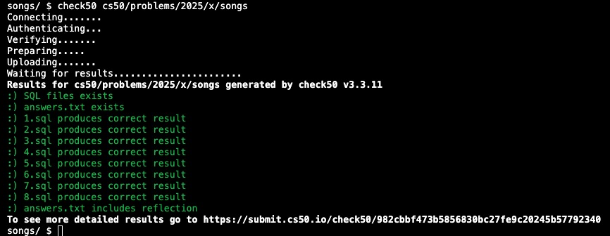

# Week 7 SQL (2025) problem set 7

SQL: Tables; Types; Statements; Constraints; Indexes; Keywords, Functions; Transactions. Race Conditions. SQL Injection Attacks.

1. [lecture](https://cs50.harvard.edu/x/2025/weeks/7/)
2. [notes](https://cs50.harvard.edu/x/2025/notes/7/)
3. [problem set 7](https://cs50.harvard.edu/x/2025/psets/7/)

## Songs

1. assignment 1 of 3
2. [requirements](https://cs50.harvard.edu/x/2025/psets/7/songs/)
3. TL;DR given a songs DB, write queries to get certain data/data results from it.
4. [songs.sql](songs.sql)

Satisfies requirements

## Movies

1. assignment 2 of 3
2. [requirements](https://cs50.harvard.edu/x/2025/psets/7/movies/)
3. TL;DR given the IMDB DB, write queries to get certain data/data results from it.
4. [movies.sql](movies.sql)

Satisfies requirements

## Fiftyville

1. assignment 3 of 3
2. [requirements](https://cs50.harvard.edu/x/2025/psets/7/fiftyville/)
3. TL;DR given a DB of data related to crime, finance, flights, calls, people & security logs, figure out 3 things: (1) Who the thief is, (2) What city the thief escaped to, and (3) Who the thief’s accomplice is who helped them escape.
4. [fiftyville.sql](fiftyville.sql)

Satisfies requirements

